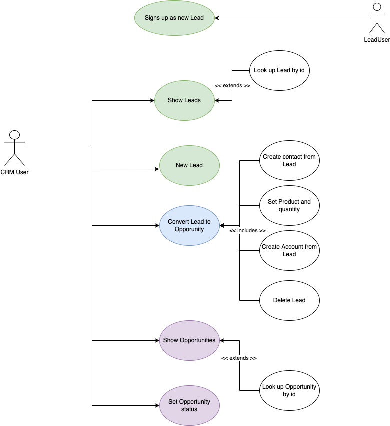
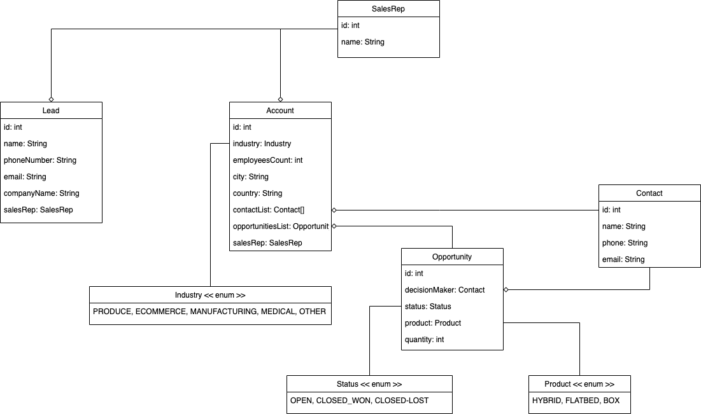
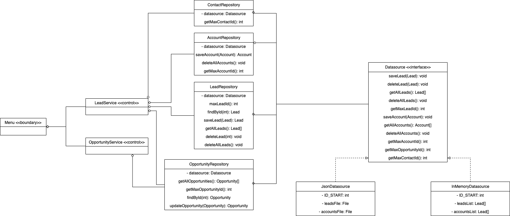

# <h1 style="text-align: center; color : blueviolet; font-family : Courier New;">CRM Project TEAM-5</h1>

<div align="center"></div>
<div>

<h2  style="font-family : Courier New; font-size : 25px;">Team Members :</h2>

- Alejandro Arraiza.
- Miguel A. Correa.
- Isabel Calzadilla.

<!-- TOP ANCHOR WITH ID TO CALL -->
<a href="#top" id="top"></a>

<h2 style="font-family : Courier New; font-size : 25px;">Menu : </h2>

<details>
  <summary>Table of Contents</summary>
  <ol>
    <li>
      <a href="#sintesis">About the Project</a>
      <ul>
        <li><a href="#tecnologias">Built With</a></li>
      </ul>
    </li>
    <li>
      <a href="#aplicacion">Getting Started</a>
      <ul>
        <li><a href="#prerequisites">Prerequisites</a></li>
        <li><a href="#installation">Installation</a></li>
      </ul>
    </li>
    <li><a href="#usage">Usage</a></li>
    <li><a href="#modelo1">Use Case Diagram</a></li>
    <li><a href="#modelo2">Class Diagram</a></li>
    <li><a href="#modelo3">Arch Diagram</a></li>
  </ol>
</details>

<h2 style="font-family : Courier New; font-size : 25px;" id="sintesis">About the Project</h2>

<br />
<div align="center">
  <a href="https://github.com/J3-PT-Java-Bootcamp/Team5-CRM/blob/develop/DEFINITION.md">
    
  </a>
  <p align="center">
    Ironhack Requirements The Data Layer Homework!
    <br />
    <a href="https://github.com/J3-PT-Java-Bootcamp/Team5-CRM/blob/develop/DEFINITION.md"><strong>Explore the docs »</strong></a>
</div>


<p align="right">(<a href="#top" >back to top</a>)</p>

<h2 style="font-family : Courier New; font-size : 25px;" id="tecnologias">Tools</h2>


<details>
  <ol>
    <li>
      <a href="#">Backend :</a>
      <ul>
        <li>Java 17.</li>
      </ul>
    </li>
    <li>
      <a href="#">Visual :</a>
      <ul>
        <li>Javax Swing Library</li>
        <li>FlatLaf Open Source Library</li>
      </ul>
    </li>
    <li>
      <a href="#">Sprints :</a>
      <ul>
        <li>GitHub</li>
        <li>GitHub Projects Tools</li>
      </ul>
    </li>
  </ol>
</details>


<p align="right">(<a href="#top">back to top</a>)</p>


<h2 style="font-family : Courier New; font-size : 25px;" id="aplicacion">Install : </h2>

### Prerequisites

* IDE Java compatible

### Installation

1. Clone the repo
    ```sh
   git clone https://github.com/J3-PT-Java-Bootcamp/Team5-CRM/tree/master
   ```
2. Install maven packages

3. Start the app

4. ?????

5. Profit

<p align="right">(<a href="#top" >back to top</a>)</p>


<h2 style="font-family : Courier New; font-size : 25px;" id="usage">How to Use</h2>

1. Select a command from panel (we recommended add new values to the storage).

<div align="center"></div>

2. Create the instances of Lead with every value

<div align="center"></div>

3. Check that new value was added correctly

<div align="center"></div>

4. Follow with the exactly commands of menu.

- Check All Leads

<div align="center"></div>

- Or another command

<div align="center"></div>

<p align="right">(<a href="#top" >back to top</a>)</p>

<h2 style="font-family : Courier New; font-size : 25px;" id="modelo1">Use Case Diagram</h2>

The use case show how a user could do it different opperations in the CRM, just with a few command lines.

### Available Operations :


- Add New Lead.
- Show Leads.

      - Lookup Leads by ID.
- Convert Lead to Opportunity.

      - Create contact from Lead.
      - Set Products and Quantity.
      - Create Account from Lead.
      - Delete Lead.
- Show Opportunities.

      - Lookup Opportunity by ID.
- Setting the Opportunity status.



<p align="right">(<a href="#top" >back to top</a>)</p>

<h2 style="font-family : Courier New; font-size : 25px;" id="modelo2">Class Diagram</h2>

### The Class in the Application are:

#### Basic Instances

- Account.
- Contact.
- Lead.
- Opportunity.


#### Enums

- Industry.
- Product.
- Status.



<p align="right">(<a href="#top">back to top</a>)</p>

<h2 style="font-family : Courier New; font-size : 25px;" id="modelo3">Arch Diagram</h2>

#### Logic of Bussiness

##### Services

- Menu.
- Opportunity Services.
- Contact Repository.
- Account Repository.
- Lead Repository.
- Opportunity Repository.


##### Controllers

- Lead Services.
- Opportunity Services.

##### Interfaces

- DataSource.
- JsonDataSource.
- InMemoryDataSource.



<p align="right">(<a href="#top">back to top</a>)</p>

</div>
