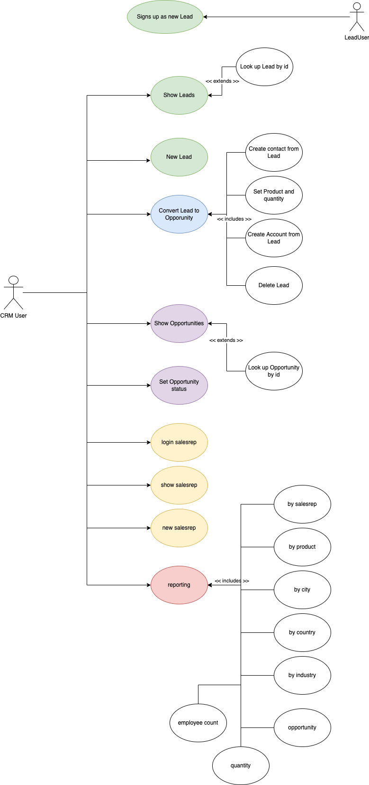

# CRM Project TEAM-5


## Team Members:

- Alejandro Arraiza.
- Miguel A. Correa.
- Isabel Calzadilla.

<!-- TOP ANCHOR WITH ID TO CALL -->
<a href="#top" id="top"></a>

## Menu:

### Table of Contents
1. About the Project 
    - Built With
2. Getting Started 
    - Prerequisites
    - Installation
3. Usage
4. Use Case Diagram
5. Class Diagram
6. Arch Diagram

## About the Project


[](DEFINITION.md)

Ironhack Requirements The Data Layer Homework!

[Explore the requirements >>](DEFINITION.md)


<p align="right">(<a href="#top" >back to top</a>)</p>

## Tools

1. Backend
    - Java 17
2. UI
    - Javax Swing Library
    - FlatLaf Open Source Library
3. Project management
    - GitHub
    - GitHub Projects Tools

<p align="right">(<a href="#top">back to top</a>)</p>


<h2 style="font-family : Courier New; font-size : 25px;" id="aplicacion">Install : </h2>

### Prerequisites

* IDE Java compatible

### Installation

1. Clone the repo
    ```sh
   git clone https://github.com/J3-PT-Java-Bootcamp/Team5-CRM/tree/master
   ```
2. Install maven packages

3. Start the app

4. ?????

5. Profit

<p align="right">(<a href="#top" >back to top</a>)</p>


<h2 style="font-family : Courier New; font-size : 25px;" id="usage">How to Use</h2>

1. Select a command from panel (we recommended add new values to the storage).

<div align="center"></div>

2. Create the instances of Lead with every value

<div align="center"></div>

3. Check that new value was added correctly

<div align="center"></div>

4. Follow with the exactly commands of menu.

- Check All Leads

<div align="center"></div>

- Or another command

<div align="center"></div>

<p align="right">(<a href="#top" >back to top</a>)</p>

## Use Case Diagram



<p align="right">(<a href="#top" >back to top</a>)</p>

## Class Diagram


<p align="right">(<a href="#top">back to top</a>)</p>

## Arch Diagram


<p align="right">(<a href="#top">back to top</a>)</p>

